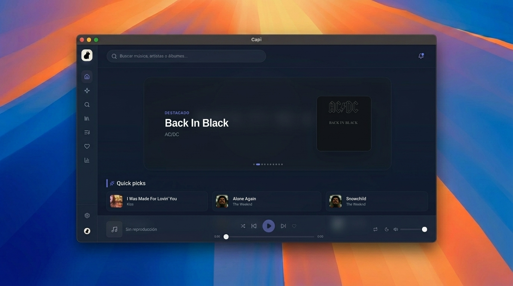

# 🎧 Capi Desktop

  

  <strong>@jhezdev</strong>

Capi es un reproductor de música premium para escritorio diseñado para ofrecer una experiencia estética, ultra-rápida y fluida. Integra reproducción en línea, soporte para archivos locales y gestión de datos con cero configuraciones complejas.

## ✨ Características Principales

*   **🎧 Reproducción en Streaming y Descargas**: Busca tus canciones y artistas favoritos, reprodúcelos al instante o descárgalos para escucharlos sin conexión.
*   **📂 Modo Biblioteca Local**: Selecciona cualquier directorio en tu sistema de manera nativa para indexar, listar y escuchar tus archivos de audio locales (`.mp3`, `.wav`, `.m4a`, `.ogg`, `.flac`, `.aac`).
*   **📜 Sincronización Interactiva de Letras**: Letras sincronizadas con opción de traducción al instante. Incluye un candado de bloqueo que desactiva el scroll táctil para enfocar la línea actual o permite el desplazamiento libre cuando está abierto.
*   **📊 Estadísticas Avanzadas**: Tarjetas visuales de rendimiento de escucha, gráficos de Top Artistas más escuchados y exportación/importación de tus datos en JSON para respaldos.
*   **🎛️ Modales y Controles Integrados**: Ventanas emergentes nativas y elegantes de confirmación que reemplazan las ventanas del navegador.
*   **⚙️ Configuración Personalizada**: Personaliza el comportamiento de la barra lateral al iniciar (colapsada o expandida) y activa el inicio de la app junto con el arranque del sistema.

---

## 🚀 Instalación y Uso

**No necesitas realizar ninguna compilación técnica.** Capi se distribuye como una aplicación compilada lista para usar.

1.  Descarga el ejecutable correspondiente a tu sistema operativo desde la sección de **Releases** de este repositorio.
2.  Dale permisos de ejecución si estás en Linux (por ejemplo, `chmod +x Capi-Desktop`).
3.  ¡Ejecuta la aplicación y disfruta de tu música!

---

## 💻 Requisitos del Sistema

*   **Rendimiento Ligero**: Capi está optimizado con Tauri y Rust para consumir muy pocos recursos de hardware, manteniéndose típicamente en menos de **130 MB de memoria RAM** durante su uso continuo.
*   **Compatibilidad**: Disponible para Linux, Windows y macOS.

---

  <strong>@jhezdev</strong>

